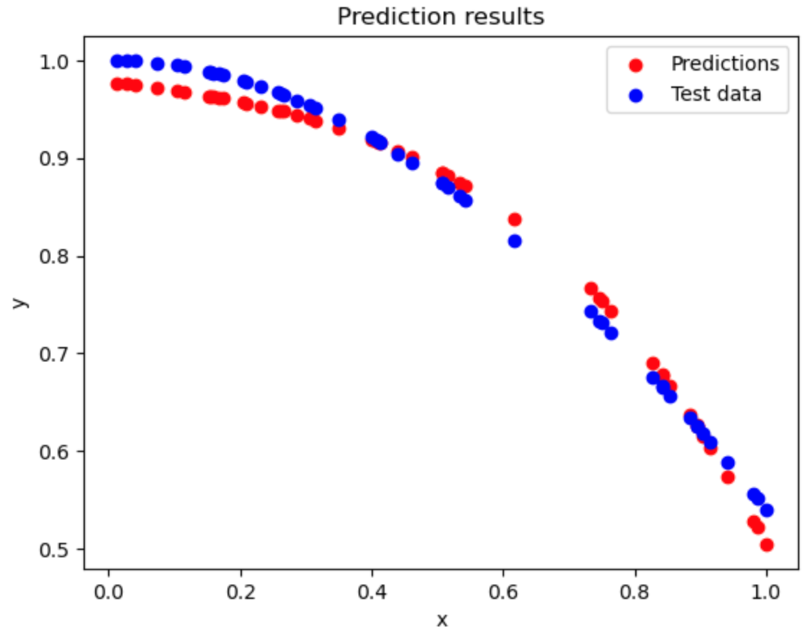

# Vanilla Neural Network Implementation

In this notebook, a vanilla dense neural network is implemented using the `Dense` class. The `Dense` class contains two methods, `forward` and `backward`, which implement the forward and backward propagation algorithms, respectively. After implementing the `Dense` class, two neural networks are created to solve the MNIST classification task and the cosine function regression task. The results demonstrate that the implemented neural network can successfully handle simple regression and classification tasks with decent performance.

## 1. MNIST Classification Task:

The MNIST images are flattened and then passed into a dense neuron with an output dimension of 32. The outputted vector is subsequently fed into a softmax neuron with an output size of 10.

The model is trained for 70 epochs, achieving a final loss of 0.022. The test accuracy is reported as 82%.

## 2. Cosine Function Regression Problem:

Sixty data points are generated from the ground truth cosine function $f(x) = \cos(x)$.

    

The training data is passed into two hidden dense neurons with the hyperbolic tangent (tanh) activation function. The choice of the tanh function is made because unbounded activation functions can face problems such as exploding gradients.

The model is trained for 200 epochs, resulting in a final loss of 0.018. The final test loss is reported as 0.210.

    

